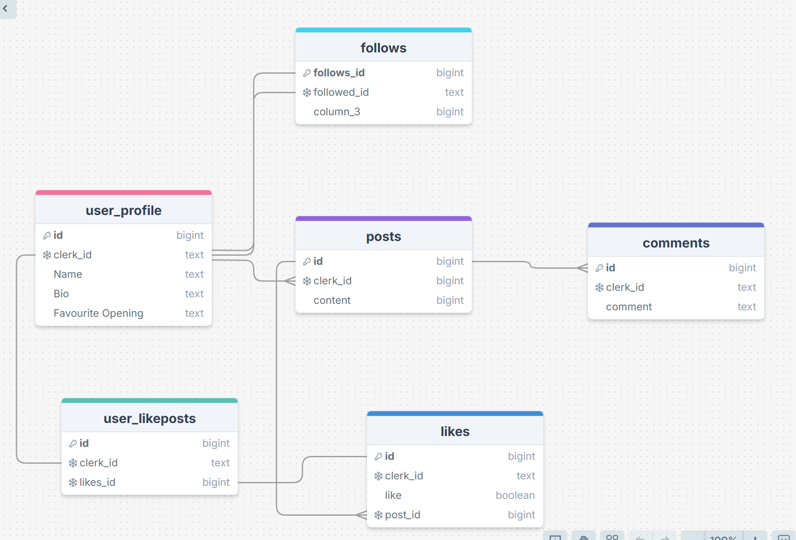
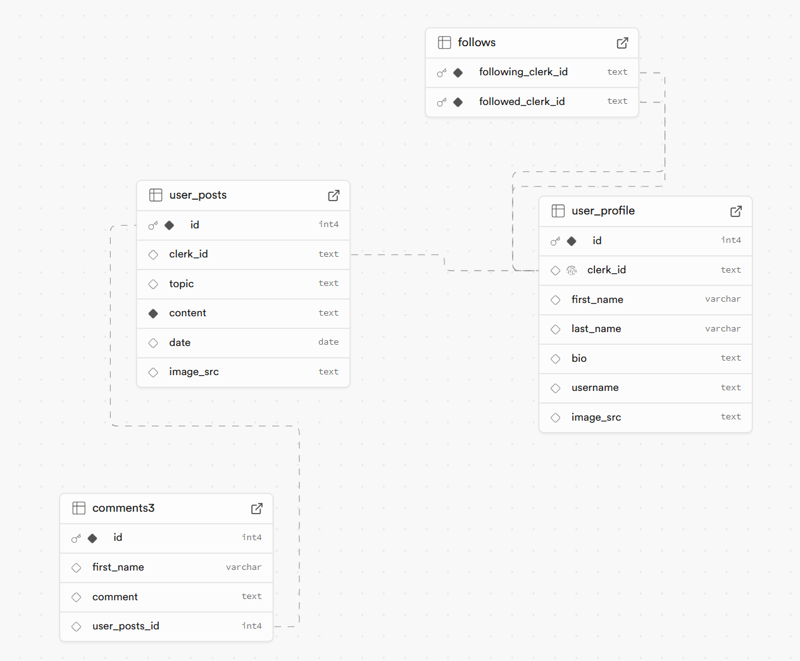

### What does the site do?

This is a full stack social media site with user authentication. Users can make there own profile, post blogs, comment and edit posts. Users also have the ability to see profiles and posts from other users. The ability to follow other users and have their posts appear on your news feed is also available.

### Requirements

- 🎯 Set up user sign-up and user login using Clerk. - done
- 🎯 Create and display an error page if the user visits a user profile that doesn’t exist. - done on the posts dynamic pages
- 🎯 Use 1 or more Radix UI Primitive or something similar (e.g. use of another library to enhance UX). - Unfortunately i ran into issues with NEXT 15 compatibility and didnt have time to figure them out, so i skipped this part
- 🎯 Enable users to create a user profile, and input profile information (such as a user biography) using a form. Users and user information should be stored in their own table in the database and handled with an appropriate route (e.g. `/user/[userId]`). - done
- 🎯 Enable users to create posts associated with their Clerk userId. Posts should be displayed on the user’s profile page. - done

### Stretch Requirements

- 🏹 Allow users to view other profiles directly from posts they see on the global timeline. - done
- 🏹 Let users follow each other by establishing a `follower` and `followee` relationship between profiles. - done, proud of figuring this one out!
- 🏹 Enable users to like posts by linking their `user_id` to the `liked_post` in a junction table. - not done due to time. decided to skip this one as i sort of did it last week
- 🏹 Ensure that a user’s biography cannot be left blank. If a user logs in without one, prompt them to add this information. - not done

### Planning

This was my initial plan. By far the complex schema i've attempted. I discussed it with Hannifah and with Manny

This is what I implemented. It was a bit too ambitious to attempt everything due mainly to time

### What went well

I'm pleased that I managed to do a few of the stretch goals, particularly letting users see every user on the site and following/follower functionality. This adds to the user experience a lot and is a key part of any social media site. In the process i had to get more comfortable with databases and JOIN queries!
There was a lot to figure out this weekend, and with the time constraint it was very challenging

### What I found difficult

In trying to add more functionality to my site i was very pushed for time so had to make sacrifices in other areas:
i rushed the styling somewhat
there are validation issues that i wasnt fully able to test and fool proof. For example i think if a user does not give an image link when making a post or setting up their profile it could cause issues with Nexts Image component.
if a user follows someone they are already following it causes an error. I didnt have time to smooth that over
Also a user can follow himself
I didnt have time to implement likes.
I added the ability to edit posts but not profiles
i added the ability to delete comments but not posts
i didnt add a Radix UI component. I need to experiment a bit here

A lot of the above points can be implemented with more time but there are a couple i am not sure about

### Sources I used

[https://stackoverflow.com/questions/62360309/is-this-social-media-platform-postgresql-database-design-right](https://stackoverflow.com/questions/62360309/is-this-social-media-platform-postgresql-database-design-right)
This was on Hannifahs suggestion and proved to be very useful with the follows

[https://clerk.com/docs/deployments/clerk-environment-variables#sign-in-and-sign-up-redirects](https://clerk.com/docs/deployments/clerk-environment-variables#sign-in-and-sign-up-redirects)
clerk docs in general
